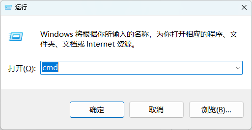

# 使用环境

> Python 3.8
>
> ffmpeg
>
> 阿里云百炼大模型

## 安装Python依赖库

```bash
pip install -r requirements.txt
```

## ffmpeg 安装

`ffmpeg` 下载地址：https://www.gyan.dev/ffmpeg/builds/#release-builds


安装步骤：


# API_KEY获取

注册阿里云账号：https://bailian.console.aliyun.com/#/home

创建API_KEY：


配置API_KEY到系统环境变量里面, 右键开始菜单打开`CMD`




```bash
setx DASHSCOPE_API_KEY "sk-232xxxxxxxxxxxxxxxsdf"
```


查看环境变量是否生效（关闭当前终端再重新打开一个）

```bash
echo %DASHSCOPE_API_KEY%
```


# 运行测试

可以使用Python打开项目运行根目录下的`main.py`文件，如图:


或者在终端窗口运行下面的命令：

```
python3 main.py
```

## 运行效果


